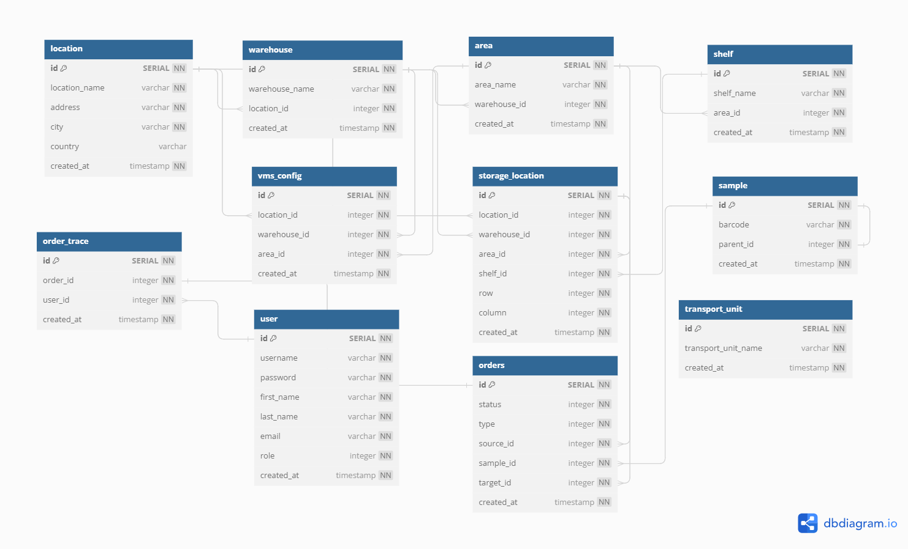

# Warehouse Management System (WMS) WebAPI

This repository contains the source code for a Warehouse Management System (WMS), implemented as a .NET Core 6 Web API. The API facilitates efficient management of warehouse operations, including inventory tracking, order management, and real-time updates on stock levels.

## Features

- **Inventory Management:** Track and manage stock levels, product details, and locations within the warehouse.
- **Order Processing:** Automate order entry, processing, and tracking to streamline warehouse operations.
- **Real-Time Updates:** Receive immediate updates on stock levels, order statuses, and more.

## Tech Stack

- **.NET Core 6 Web API:** The backend API is built using .NET Core 6, providing a robust framework for developing high-performance web services.
- **JWT Authentication:** Secure API endpoints using JWT (JSON Web Tokens) to ensure that only authorized users can access sensitive information.
- **PostgreSQL Database:** Store and manage data using PostgreSQL, a powerful open-source relational database system.

## Database Diagram

Below is the database diagram for the Warehouse Management System, outlining the structure and relationships between the various entities.

